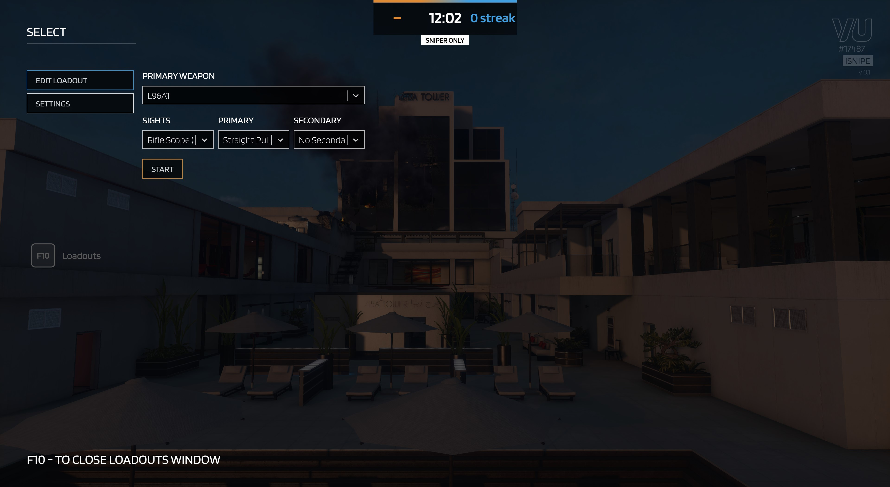

# iSnipe - Sniper Game mode for Venice Unleashed Battlefield 3

iSnipe is a fast paced, high intensity, close quarter combat mod built for [Venice Unleashed.](https://veniceunleashed.net/) Based on the original popular mod iSnipe from the Call of Duty: Modern Warfare 2 days, the objective is to get to the top of the leader board by getting the most kills. It uses BF3's Squad Death Match as basis, as this most represents a free-for-all. The mod features one-hit kill snipers, and removes the crosshair to encourage quick scoping instead of no scoping. 

## Features

### Custom Spawn System

Custom spawn system with algorithm that chooses best spawn. Currently the best spawn is determined by the distance to all players.

### Loadout Manager

Possibility to select all snipers in the game. Certain snipers have ACOGs, some do not for balancing. Originally based on [KVN's Battlefield 3 Competitive mod](https://github.com/kiwidoggie/kPM), thanks KVN!

### Killstreak Sounds

Killstreaks are tracked in iSnipe. [Remember going godlike in Quake or CSS deathmatch server?](https://www.youtube.com/watch?v=6duy25F8lpo) the iSnipe mod in VU features the same announcer killstreak, so you can make the best killstreak compilation and post it on YouTube. Don't like the sounds? Every client can easily disable them in the settings tab when selecting their loadout.

### Even more sounds

It would not be iSnipe without the classic Call of Duty hitmarker sound. So every time you hit an enemy you get the satisfying sound. Furthermore, we also included the headshot sound from BF1 to complete the experience.

### Custom Out Of Bounds

iSnipe is a (smaller) game mode which is best played with a maximum of 24 players. Normally the original map size of a Squad Death Math is too large for this player size. To ensure intense gameplay whether 10 or 20+ players are online, the out of bounds map are decreased. Uses [MapZoneHelper](https://github.com/J4nssent/VU-Mods/tree/master/MapZoneHelper), thanks J4nssent!

## Additional Features

#### Killstreak System

Currently only features a Venom helicopter which is flown by an AI. Player spawns in the gunner seat, and has about two orbits to wreak havoc on the map. Adds on to [VU-Killstreak](https://github.com/Maxinger15/VU-Killstreak). The Venom killstreak is not directly incorporated into iSnipe, so you can choose to add it on. The Venom-Killstreak can be found [here](https://github.com/RonnieOnTheHub/VenomKillstreak).

## Maps

iSnipe features many maps, but not all of the maps currently offered in BF3 and all expansions packs. More maps will be added later. The current maps that can be played are:

* Ziba Tower
* Noshahr Canals
* Seine Crossing
* Scrapmetal
* Damavand Peak
* Donya Fortress
* Strike at Karkand
* Teheran Highway
* Armored Shield
* Operation 925
* Bandar Desert
* Alborz Mountains

## Video
Onn Sight made a video when iSnipe was still in alpha:

# Future plans

In the future we intend to improve iSnipe even further

* Improve spawn system with the use of machine learning
* More killstreaks
* Functionality to choose killstreaks, like in COD
* Custom assets soldiers
* Enemy-Foe counter on death

